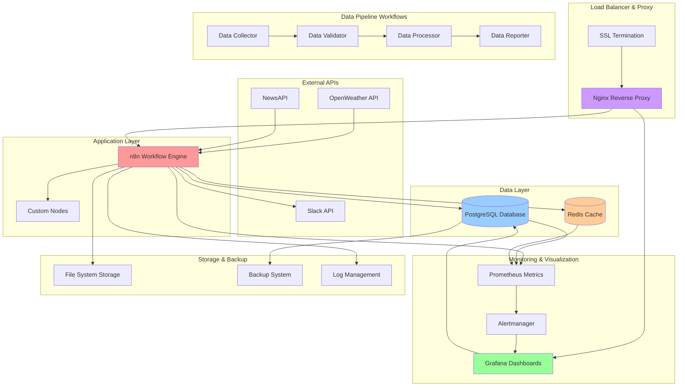
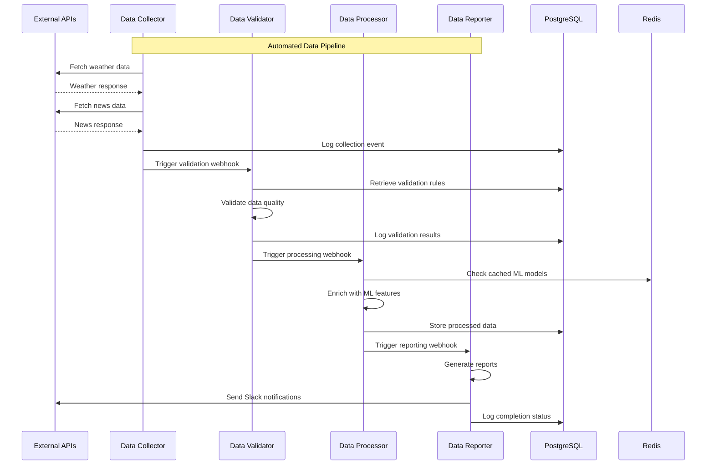
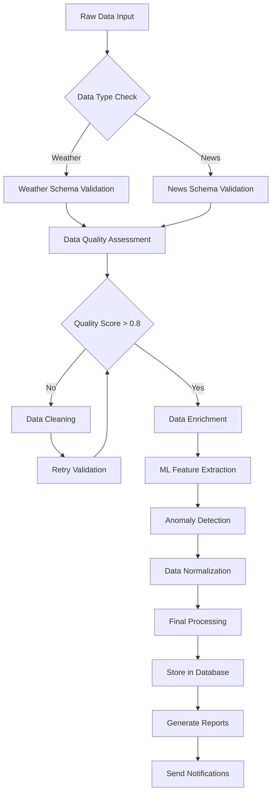
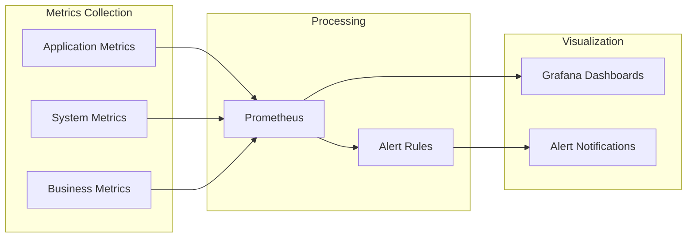
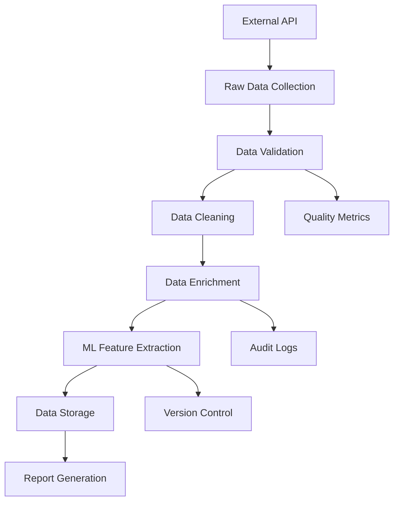
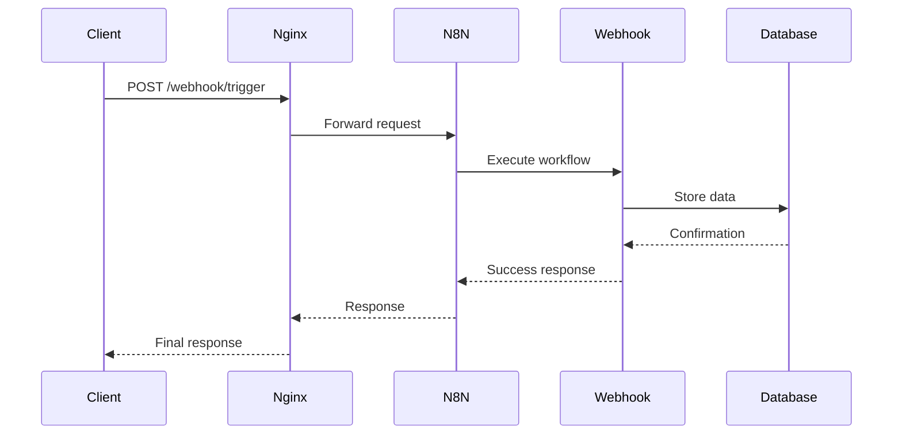
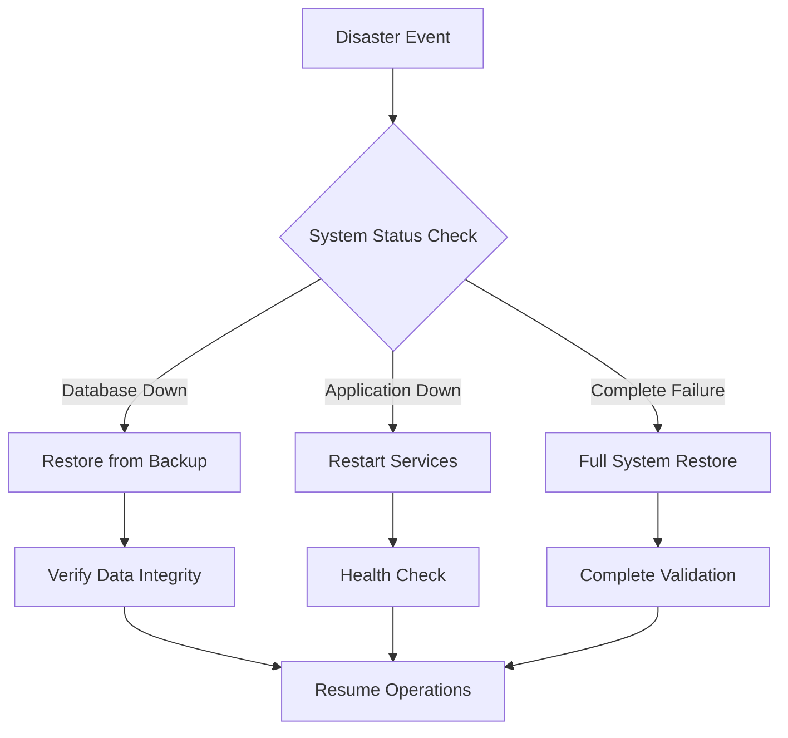

# n8n Data Intelligence Orchestrator - Architecture Documentation

## System Overview

The n8n Data Intelligence Orchestrator is a comprehensive data pipeline platform that automates the collection, validation, processing, and reporting of heterogeneous data sources. Built with a microservices architecture using Docker containers, it provides scalable, reliable, and maintainable data orchestration capabilities.

## Architecture Diagram



## Component Architecture

### 1. Application Layer

#### n8n Workflow Engine
- **Purpose**: Core orchestration platform for automated workflows
- **Technology**: Node.js-based workflow automation tool
- **Key Features**:
  - Visual workflow designer
  - 300+ pre-built integrations
  - Custom node support
  - Webhook triggers
  - Scheduled executions
  - Error handling and retries

#### Custom Nodes
- **DataTransformer Node**: Advanced data transformation operations
  - Normalization (min-max, z-score, robust scaling)
  - Aggregation (mean, sum, count, statistics)
  - Enrichment (timestamps, quality scores, geographical data)
  - Cleaning (null removal, duplicate handling, validation)
  - Feature Extraction (numerical, categorical, temporal, text)

### 2. Data Layer

#### PostgreSQL Database
- **Purpose**: Primary data persistence and ACID compliance
- **Schema Design**:
  ```sql
  -- Core data tables
  audit_logs          -- Execution tracking and auditing
  processed_data      -- Validated and enriched data
  alerts              -- System and business alerts
  data_versions       -- Data versioning and lineage
  workflow_metrics    -- Performance and execution metrics
  
  -- Grafana support
  grafana_dashboard   -- Dashboard configurations
  grafana_session     -- User sessions
  ```
- **Performance Features**:
  - Indexing on timestamp and data_type columns
  - Partitioning for large datasets
  - Connection pooling
  - Query optimization

#### Redis Cache
- **Purpose**: High-performance caching and session management
- **Use Cases**:
  - API response caching
  - Session storage
  - Queue management for n8n
  - Rate limiting data
  - Temporary data storage

### 3. Proxy & Load Balancing

#### Nginx Reverse Proxy
- **Purpose**: Request routing, SSL termination, and load balancing
- **Features**:
  - HTTP/HTTPS termination
  - Rate limiting (API: 100 req/min, Webhooks: 500 req/min)
  - Gzip compression
  - Static file serving
  - Health checks
  - Security headers

```nginx
# Example configuration
upstream n8n_backend {
    server n8n:5678 max_fails=3 fail_timeout=30s;
}

location /webhook/ {
    limit_req zone=webhook burst=20 nodelay;
    proxy_pass http://n8n_backend;
}
```

### 4. Monitoring & Observability

#### Prometheus Metrics Collection
- **System Metrics**: CPU, memory, disk usage
- **Application Metrics**: Workflow executions, API calls, processing times
- **Business Metrics**: Data quality scores, external API quotas
- **Custom Metrics**: Pipeline latency, error rates

#### Grafana Dashboards
- **System Overview**: Infrastructure health and resource utilization
- **Data Pipeline**: Workflow execution status and performance
- **Data Quality**: Validation scores and trend analysis
- **Business Intelligence**: KPI tracking and reporting

#### Alertmanager
- **Alert Routing**: Critical alerts → email/Slack, warnings → notifications
- **Alert Grouping**: Reduce noise through intelligent grouping
- **Escalation**: Progressive alert escalation based on severity

## Data Flow Architecture

### 1. Data Collection Pipeline



### 2. Data Transformation Flow



## Deployment Architecture

### Development Environment

```yaml
# docker-compose.yml (development)
services:
  postgres:
    image: postgres:15-alpine
    environment:
      POSTGRES_DB: n8n
      POSTGRES_USER: n8n
      POSTGRES_PASSWORD: n8n_password
    ports:
      - "5432:5432"
  
  redis:
    image: redis:7-alpine
    ports:
      - "6379:6379"
  
  n8n:
    image: n8nio/n8n:latest
    environment:
      DB_TYPE: postgresdb
      DB_POSTGRESDB_HOST: postgres
    ports:
      - "5678:5678"
    depends_on:
      - postgres
      - redis
```

### Production Environment

```yaml
# docker-compose.yml (production)
services:
  nginx:
    image: nginx:alpine
    ports:
      - "80:80"
      - "443:443"
    volumes:
      - ./nginx/ssl:/etc/nginx/ssl:ro
    deploy:
      resources:
        limits:
          memory: 256M
          cpus: '0.25'
  
  n8n:
    image: n8nio/n8n:latest
    deploy:
      resources:
        limits:
          memory: 1G
          cpus: '0.8'
      restart_policy:
        condition: on-failure
        max_attempts: 3
    healthcheck:
      test: ["CMD", "wget", "--spider", "http://localhost:5678/healthz"]
      interval: 30s
      timeout: 10s
      retries: 3
```

## Security Architecture

### 1. Authentication & Authorization

- **Basic Authentication**: Username/password for API access
- **API Keys**: Optional token-based authentication
- **Role-Based Access**: Admin, editor, viewer roles
- **Session Management**: Redis-based session storage

### 2. Network Security

- **SSL/TLS Encryption**: HTTPS termination at nginx
- **Rate Limiting**: Request throttling to prevent abuse
- **IP Whitelisting**: Configurable IP-based access control
- **Security Headers**: HSTS, CSP, X-Frame-Options

### 3. Data Security

- **Encryption at Rest**: Database encryption for sensitive data
- **Credential Management**: Encrypted storage of API keys
- **Audit Logging**: Comprehensive audit trail
- **Data Validation**: Input sanitization and validation

## Performance Architecture

### 1. Scalability Patterns

- **Horizontal Scaling**: Multiple n8n instances with load balancing
- **Database Scaling**: Read replicas and connection pooling
- **Cache Layer**: Redis for high-frequency data access
- **Asynchronous Processing**: Queue-based workflow execution

### 2. Performance Optimization

- **Connection Pooling**: Database connection optimization
- **Query Optimization**: Indexed queries and materialized views
- **Caching Strategy**: Multi-level caching (Redis, application, CDN)
- **Resource Limits**: Container resource constraints

### 3. Monitoring & Alerting



## Data Architecture

### 1. Data Models

#### Weather Data Model
```typescript
interface WeatherData {
  id: string;
  timestamp: Date;
  location: {
    city: string;
    country: string;
    lat: number;
    lon: number;
  };
  current: {
    temperature: number;
    humidity: number;
    pressure: number;
    description: string;
  };
  forecast?: WeatherForecast[];
  metadata: DataMetadata;
}
```

#### News Data Model
```typescript
interface NewsData {
  id: string;
  timestamp: Date;
  articles: Article[];
  metadata: {
    totalResults: number;
    source: string;
    queryParameters: object;
  };
}
```

### 2. Data Validation Schema

```json
{
  "weather_validation_rules": {
    "temperature": {"min": -50, "max": 50},
    "humidity": {"min": 0, "max": 100},
    "pressure": {"min": 900, "max": 1100},
    "required_fields": ["temperature", "humidity", "description"]
  },
  "news_validation_rules": {
    "min_articles": 1,
    "max_article_age_hours": 24,
    "required_fields": ["title", "url", "publishedAt"]
  }
}
```

### 3. Data Lineage



## Integration Architecture

### 1. External API Integration

- **OpenWeather API**: Weather data collection with rate limiting
- **NewsAPI**: News article aggregation with filtering
- **Slack API**: Notification delivery with rich formatting
- **Email SMTP**: Alert notifications with HTML templates

### 2. Webhook Architecture



### 3. Custom Node Integration

```javascript
// Example custom node implementation
export class DataTransformer implements INodeType {
  description: INodeTypeDescription = {
    displayName: 'Data Transformer',
    name: 'dataTransformer',
    group: ['transform'],
    version: 1,
    inputs: ['main'],
    outputs: ['main']
  };

  async execute(this: IExecuteFunctions): Promise<INodeExecutionData[][]> {
    const items = this.getInputData();
    const operation = this.getNodeParameter('operation', 0) as string;
    
    // Transform data based on operation
    const transformedData = await this.transformData(items, operation);
    
    return [transformedData];
  }
}
```

## DevOps Architecture

### 1. CI/CD Pipeline

```yaml
# GitHub Actions workflow
name: CI/CD Pipeline
on:
  push:
    branches: [main]
  pull_request:
    branches: [main]

jobs:
  test:
    runs-on: ubuntu-latest
    steps:
      - uses: actions/checkout@v2
      - name: Run tests
        run: |
          docker-compose -f docker-compose.test.yml up --abort-on-container-exit
      
  deploy:
    needs: test
    runs-on: ubuntu-latest
    if: github.ref == 'refs/heads/main'
    steps:
      - name: Deploy to production
        run: |
          docker-compose -f docker-compose.prod.yml up -d
```

### 2. Backup Strategy

- **Database Backups**: Daily automated PostgreSQL dumps
- **Configuration Backups**: Workflow and system configuration
- **Volume Backups**: Docker volume snapshots
- **Retention Policy**: 7 days daily, 4 weeks weekly, 6 months monthly

### 3. Disaster Recovery



## Cost Optimization

### 1. Resource Allocation

- **CPU**: Dynamic scaling based on workflow load
- **Memory**: Optimized container memory limits
- **Storage**: Efficient data compression and archival
- **Network**: CDN for static assets, optimized API calls

### 2. Service Optimization

- **Database**: Query optimization, index management
- **Cache**: Intelligent cache invalidation strategies
- **Monitoring**: Metric aggregation and retention policies
- **Backup**: Incremental backups with compression

## Future Architecture Considerations

### 1. Scalability Enhancements

- **Microservices**: Split monolithic n8n into specialized services
- **Kubernetes**: Container orchestration for auto-scaling
- **Event Streaming**: Apache Kafka for real-time data processing
- **Data Lake**: Long-term storage for historical data analysis

### 2. Advanced Analytics

- **Machine Learning**: Real-time ML model serving
- **Stream Processing**: Apache Spark for large-scale data processing
- **Time Series Database**: InfluxDB for high-frequency metrics
- **Data Warehouse**: Snowflake/BigQuery for analytical workloads

### 3. Security Enhancements

- **Zero Trust Architecture**: Identity-based security model
- **Service Mesh**: Istio for inter-service communication security
- **Secret Management**: HashiCorp Vault for credential management
- **Compliance**: GDPR, SOC2, HIPAA compliance frameworks

## Troubleshooting Guide

### Common Issues and Solutions

1. **High Memory Usage**
   - Monitor container resource limits
   - Optimize workflow node memory usage
   - Implement data pagination for large datasets

2. **Database Connection Issues**
   - Check connection pool settings
   - Verify network connectivity
   - Monitor database performance metrics

3. **Workflow Execution Failures**
   - Review execution logs in n8n
   - Check external API rate limits
   - Validate webhook configurations

4. **Performance Degradation**
   - Analyze Grafana dashboards
   - Review Prometheus alerts
   - Optimize database queries

### Monitoring Checklist

- [ ] All services healthy in Docker Compose
- [ ] Database connections stable
- [ ] External API quotas sufficient
- [ ] Workflow execution success rate > 95%
- [ ] System resource utilization < 80%
- [ ] Error rate < 1%
- [ ] Alert notifications functioning

## Conclusion

The n8n Data Intelligence Orchestrator provides a robust, scalable, and maintainable architecture for automated data processing. Its modular design enables easy expansion and customization while maintaining high availability and performance standards.

For deployment instructions, see [DEPLOYMENT.md](./DEPLOYMENT.md).  
For API documentation, see [API_DOCS.md](./API_DOCS.md).  
For operational procedures, see [OPERATIONS.md](./OPERATIONS.md).